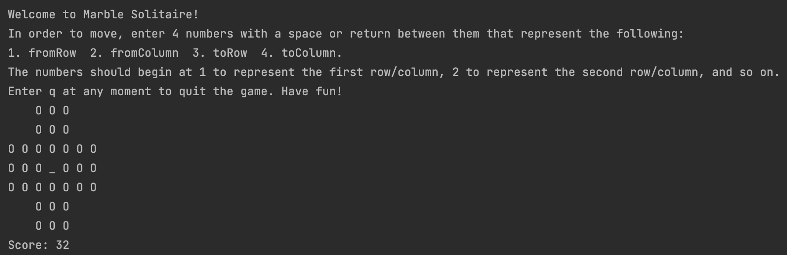

# **Marble Solitaire**

### **Description**  
Marble Solitaire is a Java application which allows users to play marble solitaire. If unfamiliar with the game, [see here for more](https://webgamesonline.com/peg-solitaire/). Our game allows users to specify board size, where they would like the starting empty hole to be, and the type of board (English, European, or Triangle). The game is playable through a text-based UI, where users can specify the moves that they would like to make and are either shown the new board if a move is successful, or informed that they have attempted to make an invalid move. All functionality has been properly tested with JUnit.

### **Final Product**  
The welcome screen for one variation of the game is shown below.

